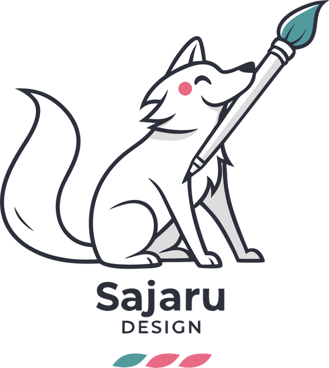

<p align="center">
  
</p>

<p align="center">
  Suite de escritorio para agencias de <b>sublimado y DTF</b>.<br/>
  Quitar fondo por lote, mejorar resolución, vectorizar logos, preparar transfers y armar <b>mockups 3D</b> con video 360°.
</p>

---

## Qué es

Sajaru Design es una app de escritorio (Electron) que junta, en una sola ventana, las
herramientas del día a día de una agencia de sublimado. El modelo mental es simple:
**cada herramienta es una tarjeta en la grilla**, agrupada por categoría (Playeras, Tazas
y vasos, Gorras, y recursos generales de diseño).

Casi todo corre **local** (gratis, privado, sin subir tus imágenes a ningún lado). Las
funciones marcadas como **IA Premium** usan una API de pago (Recraft) y consumen créditos;
son opcionales y solo se activan si cargás tu clave.

## Características

### Diseño y recursos
- **Crear diseño** — genera imágenes o vectores desde un texto (IA Premium).
- **Preparar sublimación** — tamaño físico en pulgadas, 300 DPI y espejo para el transfer (PNG/TIFF).
- **Editar imagen** — ajustes y retoques rápidos.

### Sublimado de playeras (y base para tazas/vasos/gorras)
- **Quitar fondo** — recorte con IA local (BiRefNet/U²-Net) o Premium. **Multi-imagen**:
  arrastrá varias y se tratan de forma independiente (filmstrip, *Procesar todas*,
  *Guardar todas*). Editor completo: borrar, **restaurar desde la foto original**, varita
  por color, Selección (Select & Mask), **Selección inteligente (SAM)** y *Analizar todo*,
  pulido de bordes (Niveles), **recuperar pelo** por canales y **contorno sticker (DTF)**.
- **Aumentar resolución** — upscale clásico, IA local (Real-ESRGAN) o Premium (1×–4×).
- **Vectorizar** — raster → vector por capas (Potrace) o Premium. Edición de paleta en vivo,
  *limpiar zona*, exportar **SVG / PDF / EPS / PNG** y capas por color.
- **Mockup 3D** — tu diseño sobre un producto 3D real (playera, taza, vaso, gorra): color,
  tallas, varias ubicaciones, **estampado all-over**, iluminación y exportación a **PNG** y
  **video 360° (MP4 / GIF)** para mandarle al cliente.

> Muchas herramientas encadenan con **“Enviar a”**: el resultado de una pasa a la siguiente
> sin exportar ni reimportar (p. ej. Quitar fondo → Vectorizar → Preparar sublimación → Mockup 3D).

## Requisitos (Omarchy / Arch Linux)

El paquete declara sus dependencias, pero si compilás a mano necesitás:

- **Node.js** — corre el *sidecar* (motor de imagen/IA).
- **ffmpeg** — video 360° del Mockup 3D.
- **ghostscript** — exportar vector a PDF/EPS.

```bash
sudo pacman -S --needed nodejs npm ffmpeg ghostscript
```

Los modelos de IA local se descargan solos la primera vez que se usan.

## Instalación

### Opción A — paquete pacman (recomendada en Omarchy)
```bash
# Con el .pkg.tar.zst generado por el build (ver docs/empaquetado.md):
sudo pacman -U "Sajaru Design-0.1.0.pacman"
sajaru-design
```

### Opción B — AppImage (cualquier Linux)
```bash
chmod +x "Sajaru Design-0.1.0-x86_64.AppImage"
./"Sajaru Design-0.1.0-x86_64.AppImage"
```
> El AppImage necesita `nodejs`, `ffmpeg` y `ghostscript` instalados en el sistema.

### Opción C — PKGBUILD (AUR)
Ver [`packaging/aur/PKGBUILD`](packaging/aur/PKGBUILD) y [docs/empaquetado.md](docs/empaquetado.md).

## Desarrollo

```bash
# 1) Motor (sidecar) primero
cd BackgroundRemove/sidecar
npm install
npm run build

# 2) App
cd ../../ContainerApp
npm install
npm run dev
```

Comandos útiles en `ContainerApp/`: `npm run typecheck`, `npm run build`,
`npm run dist:linux` (empaqueta para Linux).

## Compilar y empaquetar

Guía completa (incluye el detalle de compilar el sidecar **en Linux** por los binarios
nativos): **[docs/empaquetado.md](docs/empaquetado.md)**.

Resumen:
```bash
cd BackgroundRemove/sidecar && npm ci && npm run build   # motor con binarios de Linux
cd ../../ContainerApp && npm ci && npm run dist:linux     # AppImage + paquete pacman en dist/
```

## Estructura del proyecto

```
DesingAgent/
├── ContainerApp/        # Shell de Electron + mini apps (React) + plugins (main)
│   ├── src/main/        # proceso main: adapters de plugins (IPC)
│   ├── src/preload/     # puente seguro window.api
│   ├── src/renderer/    # UI: grilla + mini apps
│   ├── src/shared/      # contratos de tipos
│   ├── build/           # icono + assets de empaquetado
│   └── electron-builder.yml
├── BackgroundRemove/
│   └── sidecar/         # CLI motor (sharp + onnxruntime): quitar fondo, vectorizar, upscale…
├── packaging/aur/       # PKGBUILD para Arch/Omarchy
└── docs/                # manual, tutorial, empaquetado
```

## Documentación

- 📖 [Manual de uso](docs/manual-de-uso.md) — cada herramienta en detalle.
- 🚀 [Tutorial](docs/tutorial.md) — de la foto del cliente a la playera lista, paso a paso.
- 🧱 [Arquitectura](ARCHITECTURE.md) — cómo está armado (container · plugin · sidecar).
- 📦 [Empaquetado para Omarchy](docs/empaquetado.md) — compilar y distribuir.

## IA Premium (opcional)

Las funciones Premium usan la API de Recraft y **consumen créditos**. Se activan cargando
tu clave (se guarda localmente en `~/.sajaru/recraft.key`; la app nunca la envía a otro
lado que no sea Recraft). Sin clave, todo lo **local** funciona igual.

## Licencia

Software propietario de Sajaru Design. Todos los derechos reservados.
